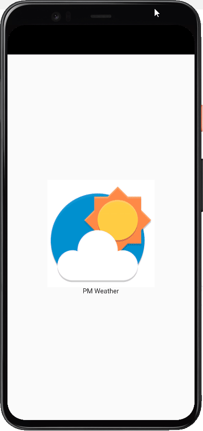

# PM_WeatherApp

## Description

WeatherView is a mobile application built using Flutter and Convolutional Neural Networks (CNN). The app provides real-time weather data based on the user's GPS location and displays world maps with various weather conditions overlaid, such as precipitation, temperature, wind, and storms. Additionally, the app includes a module that can detect and predict weather conditions from a photo taken with the camera or uploaded from the gallery.

## Technologies

## Demo
### Weather conditions

### Maps condtions

### ML weather prediction

